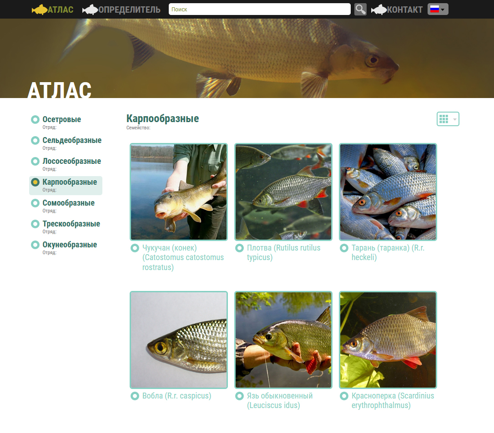
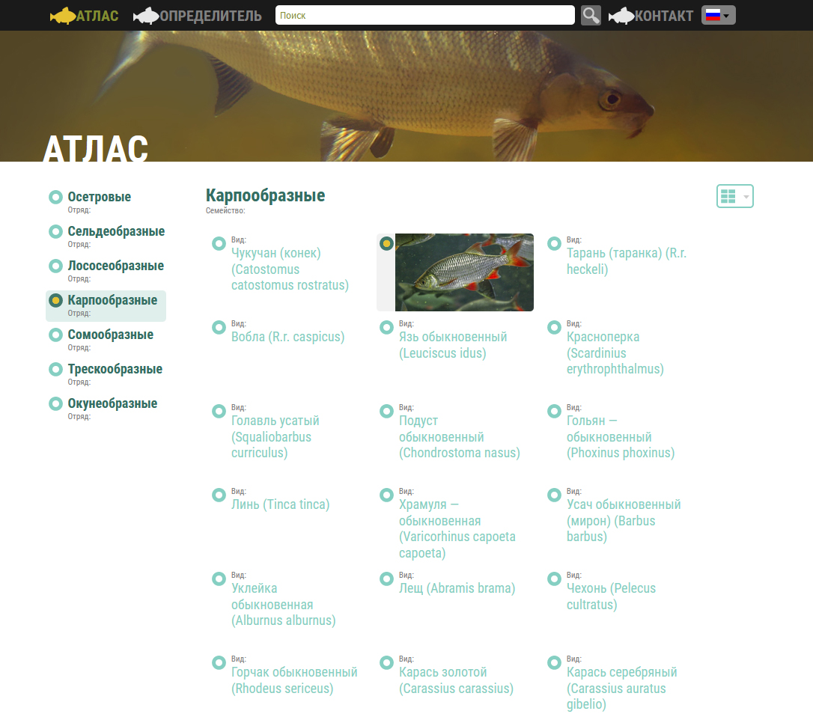
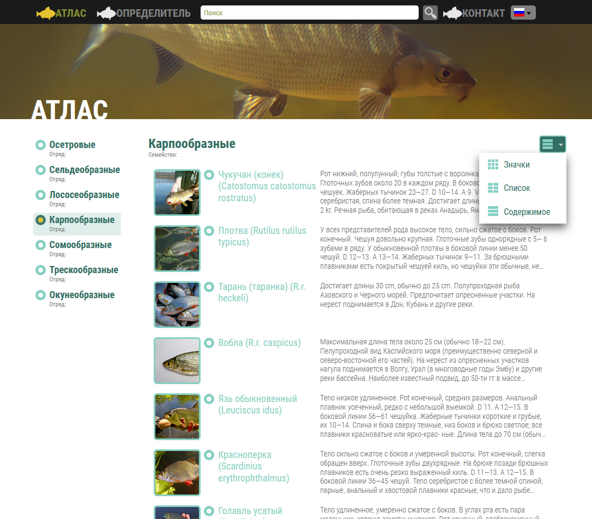
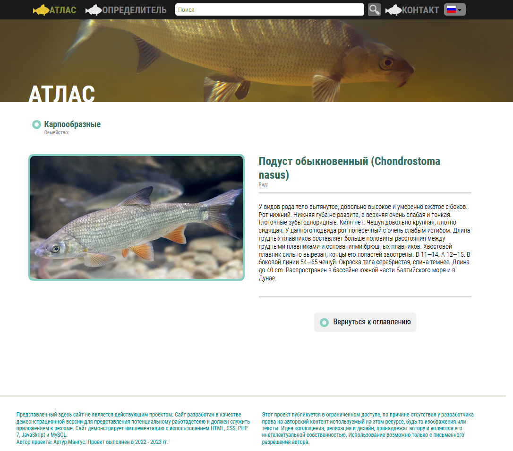
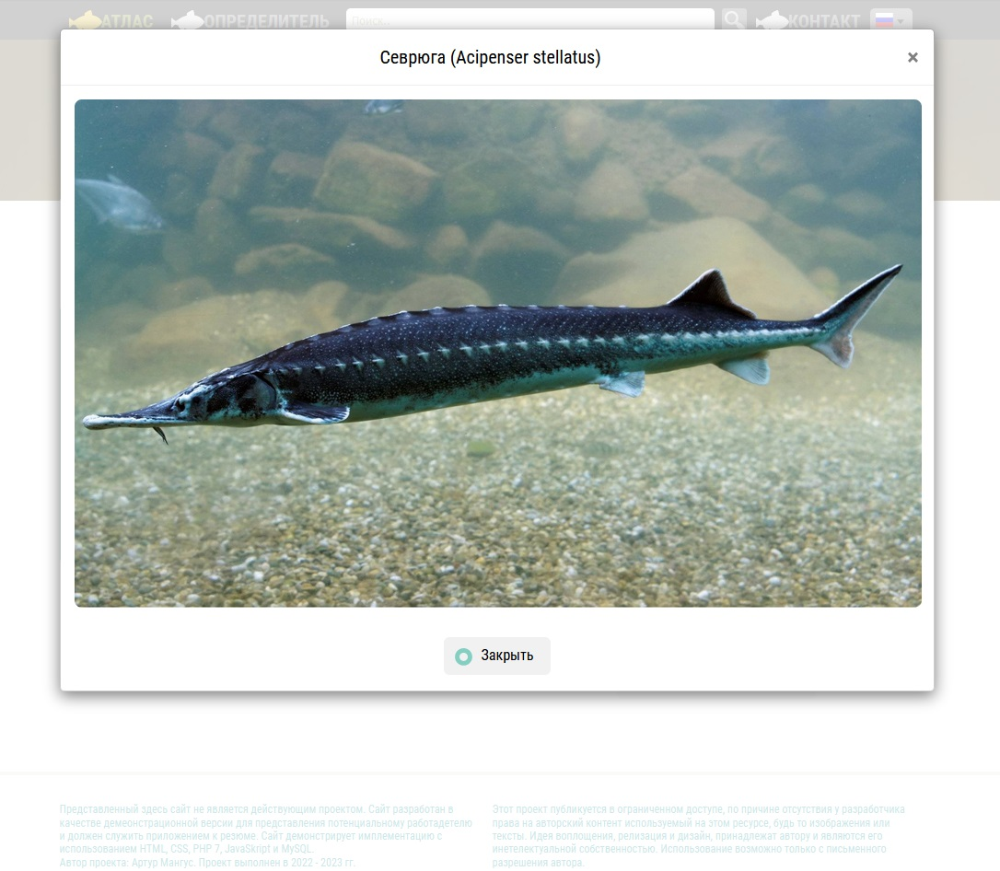

# Fish Atlas #
## База данных речных и озерных рыб водоемов РФ ##
Демонстрационный проект реализации web-приложения с использованием <b>PHP, CSS, JavaScript</b> и <b>MySQL</b>.  
Этот проект является частью резюме, и размещен для просмотра потенциальным работодателем. 
Проект включает только самые необходимые элементы реализаций, используемых в каждом проекте, такие как

* меню глобальной навигации
* древовидное меню навигации
* выпадающие меню типа DropDown
* представления информации в виде предпросмотра, списка или содержания
* формы ввода для передачи данных на сервер
* и прочее

Для тестирования проекта необходимо скачать архив на локальный хост, и распаковать его в папке htdocs локального веб-сервера.
В папке проекта ./db размещен файл installdb.txt. Запуск файла на сервере MySQL создает базу данных fishatlas со всеми необходимыми таблицами и записями.  

  
<b>Приведенная база данных составлена на основе атласа-определителя рыб за авторством Н.А. Мягкого, и не может быть использована для публичного доступа, без разрешения автора. Все права на используемый текст принадлежат Н.А. Мягкову. Весь фотоматериал найден поисковой машиной Yandex и не может быть использован для публичного доступа, без разрешения авторов изображений.</b>  

